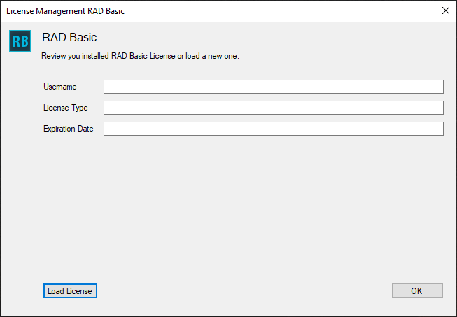

## How to load license

You need a license to run RAD Basic. You should receive your license by email when you subscribe as a Patreon member.

To load your license you have to follow this simple instructions:

1. Download your license file from your email into a folder of your computer.
1. Open RAD Basic and License Window will appear. If it is not shown, you could open it from menu: **Help -> License Management**

Then, with "Load License" button, you could select the license file saved previously.