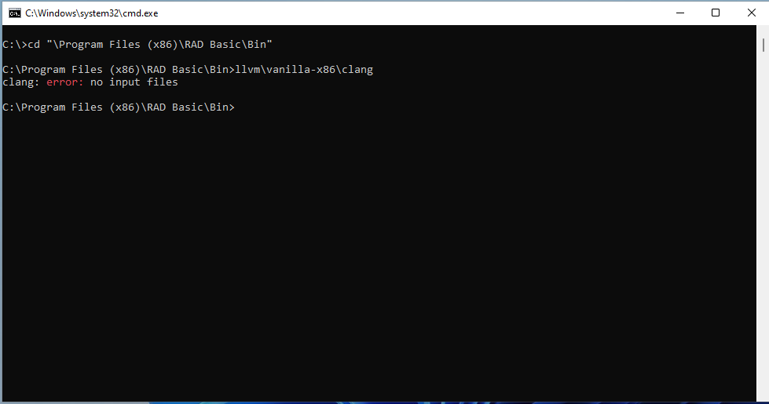
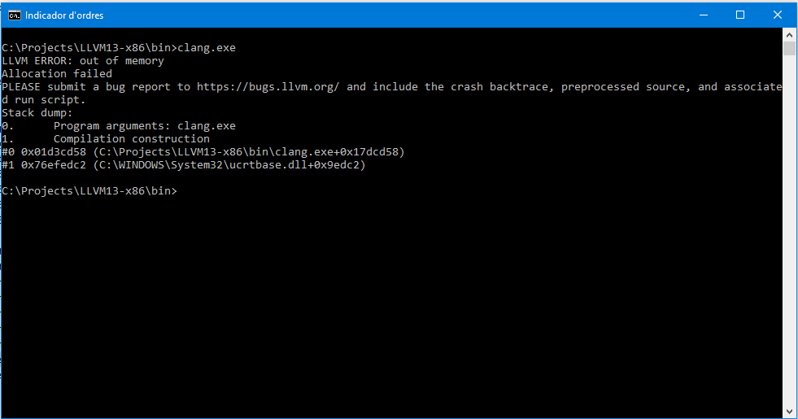
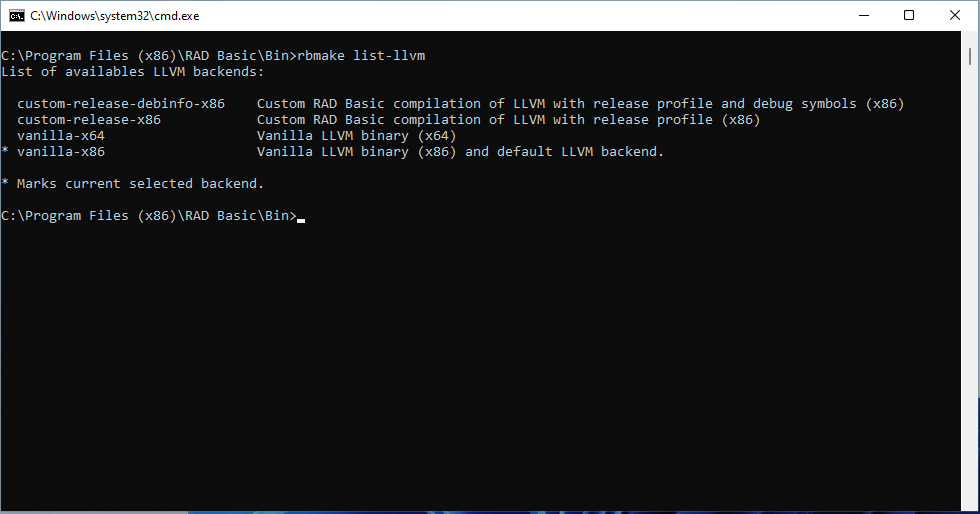

## Troubleshoot issue: Internal error in linking phase

### Description

When you compile a shipped sample with no modification and this error arises:

  There were errors:
  	internal error parsing project: Internal error in linking phase. Code: 1

It could be a problem of execution of LLVM CLANG, which is the C compiler used by RAD Basic for generating machine code.

There are report in some machines with Visual Studio 2019 installed, clang official binary can run in it.

Please follow this steps for reproduce the error.

### Steps for reproduce it

You could follow this steps for fixing it

1. Open a CMD and goes to "bin" folder into RAD Basic installation dir. For example, for default installation:
   cd "C:\Program Files (x86)\RAD Basic\bin"

2. There, run clang compiler without parameters (RAD Basic includes several LLVM Clang distribution, we will see it later):
    llvm\vanilla-x86\clang.exe
3. If it runs smoothly, you have to see this output:

4. There are a problem with clang if you see a similar output as:

If you see the clang crash, please follow next steps for trying another LLVM CLANG backend

### Change LLVM backend

If you have problems with default LLVM backend, you could change it by command line.

Note: You have to do select Complete installation during setup for installing additional LLVM backend, as you could see in next screenshot:

In the same folder ob RAD Basic "bin", you could execute this program for listing installed LLVM backend:
  rbmake list-llvm

And it will print a list as follows:

The **vanilla-*** LLVM backends are LLVM binaries directly from LLVM distribution, meanwhile **custom-release-*** LLVM backends are compiled and shipped by RAD Basic. The **custom-release-debinfo-x86** is compiled with Visual Studio 2019 and it will likely run well in machines with issues with vanilla LLVM binaries.

You could check if this LLVM backend works in your machine running this command:

    llvm\custom-release-debinfo-x86\clang.exe

If you obtain the desired message: "*clang: error: no input files*", you could select this LLVM backend for RAD Basic.

For change LLVM backend used by RAD Basic, you have to execute this command:
  rbmake set-llvm custom-release-debinfo-x86

LLVM backend will be changed and you could try to compile again the project.
